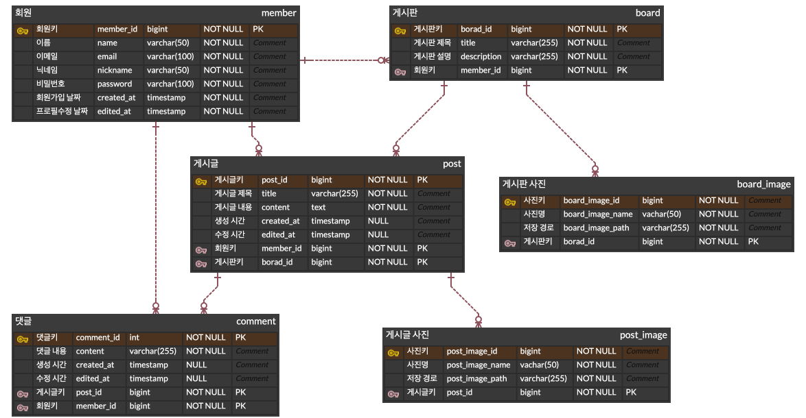
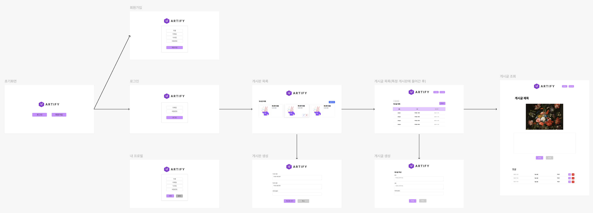

# ARTIFY

### 💬 소개
> 'Art'와 'Amplify'를 결합한 이름으로, 예술과 공연 정보를 널리 알리기 위한 예술 정보 게시판

### 👀 목적
> 전시회, 공연, 영화 상영 등 다양한 문화 이벤트 정보를 한곳에 모아
> 제공하여 필요한 정보를 쉽고 빠르게 얻을 수 있도록 합니다.

### 🏃 기간
> 24.11.04 ~ 24.11.15

### 💻 인원
> BE 3인 팀 프로젝트
<br/>

## ⚙️ 기술 스택

### Backend
 


### Frontend
 


<br/>

## 📁 프로젝트 구조

```text
src
└── main
    ├── java
    │   └── com.elice.artBoard
    │       ├── controller
    │       ├── service        
    │       ├── repository     
    │       └── entity        
    │      
    └── resources
        ├── templates          
        ├── static             
        └── application.yml
```
<br/>

## 🧩 ERD

<br/>

## ⛓️ 와이어 프레임

<br/>

## 🚨 주요 엔티티

* 회원 : 이름, 별명, ID, PW를 포함
* 게시판 : 회원, 게시판 제목, 설명을 포함
* 게시글 : 회원, 게시글 제목, 내용을 포함
* 댓글 : 회원, 게시글, 댓글 내용을 포함
* 게시판 이미지 : 게시판에서 업로드된 이미지의 원본 이름과 서버에 저장되는 이름을 포함
* 게시글 이미지 : 게시글에서 업로드된 이미지의 원본 이름과 서버에 저장되는 이름을 포함


## 🔥 주요기능

1. **회원**
    * 회원 가입 시 중복된 회원은 허용되지 않는다.
    * 회원 가입 시 아이디는 이메일 형식을 따라야 하며, 비밀번호는 영문 대소문자와 특수문자를 포함해야 한다.
    * 로그인 시 세션을 통해 로그인 상태가 유지되며, 비로그인 사용자는 로그인 페이지를 제외한 다른 페이지에 접근할 수 없다.
    * 로그인을 한 회원은 회원 정보를 수정할 수 있어야 한다.
2. **게시판**
    * 게시판은 이미지를 등록할 수 있어야 한다.
    * 게시판은 수정 및 삭제가 가능해야 한다.
    * 수정 및 삭제는 본인이 작성한 게시판에 한해서 수정 및 삭제가 가능한다.
3. **게시글**
    * 게시글은 이미지를 등록할 수 있어야 한다.
    * 게시글은 수정 및 삭제가 가능해야 한다.
    * 수정 및 삭제는 본인이 작성한 게시판에 한해서 수정 및 삭제가 가능한다.
4. **댓글**
    * 본인이 작성한 댓글만 한해서 수정 및 삭제가 가능하다.
    * 댓글을 수정한 경우 현재시간과 비교하여 수정 시간을 표시할 수 있어야 한다.
5. **게시판, 게시글 이미지**
    * 이미지는 회원이 업로드한 이름과 서버에 저장되는 이름이 달라야 한다.
    * 회원이 업로드한 이미지는 프로젝트 디렉토리 외부에 저장되어야 한다.


## 🌐 API 문서

| epic |   기능   |                설명                 | 담당  |
|:----:|:------:|:---------------------------------:|:----|
|  회원  | 회원 가입  | 이름, 이메일, 닉네임, 비밀번호 입력받아 회원 가입을 한다 | 손홍인 |
|  회원  |  로그인   |                 -                 | 손홍인 |
|  회원  |  로그아웃  |             별도 페이지 X              | 손홍인 |
|  회원  | 프로필 조회 |            본인 프로필만 조회             | 손홍인 |
|  회원  | 프로필 조회 |            	본인 프로필만 조회            | 손홍인 |
|  회원  | 프로필 수정 |            	본인 프로필만 수정            | 손홍인 |
|  회원  | 프로필 삭제 |              	회원 탈퇴               | 손홍인 |
|  -   |   -    |                 -                 |
| 게시판  | 게시판 조회 |          	단 건 조회 및 전부 조회          | 함기용 |
| 게시판  | 게시판 생성 |         	로그인 되어있는 사람만 작성          | 함기용 |
| 게시판  | 사진 저장  |                 -                 | 함기용 |
| 게시판  | 게시판 수정 |         	본인이 작성한 게시판만 수정          | 함기용 |
| 게시판  | 게시판 삭제 |         	본인이 작성한 게시판만 삭제          | 함기용 |
|  -   |   -    |                 -                 |
| 게시글  | 게시글 생성 |         	로그인이 되어있는 사람만 생성         | 조서영 |
| 게시글  | 게시글 조회 |          	단 건 조회 및 전부 조회          | 조서영 |
| 게시글  | 게시글 수정 |          	본인이 작성한 글만 수정           | 조서영 |
| 게시글  | 게시글 삭제 |          	본인이 작성한 글만 삭제           | 조서영 |
| 게시글  | 사진 저장  |                 -                 | 조서영 |
|  -   |   -    |                 -                 |
|  댓글  | 댓글 작성  |                 -                 | 함기용 |
|  댓글  | 댓글 조회  |                 -                 | 함기용 |
|  댓글  | 댓글 수정	 |         본인이 작성한 댓글만 수정 가능         | 함기용 |
|  댓글  | 댓글 삭제	 |         본인이 작성한 댓글만 삭제 가능         | 함기용 |
|  댓글  | 수정시간	  |         댓글 수정 시 수정 시간 표시          | 함기용 |


## 🛠️ 커밋 컨벤션

* 타입은 태그와 제목으로 구성되고, 태그는 영어로 쓰되 첫 문자는 대문자로 한다.
* "태그: 제목"의 형태이며, : 뒤에만 공백이 있음에 유의

|  태그 이름   |                설명                |
|:--------:|:--------------------------------:|
|   Feat   |          새로운 기능을 추가할 경우          |
|   Fix    |            버그를 고친 경우             |
|  Design  |       CSS 등 사용자 UI 디자인 변경        |
|  Style   | 코드 포맷 변경, 세미 콜론 누락, 코드 수정이 없는 경우 |
| Refactor |           프로덕션 코드 리팩토링           |
|   Docs   |           	문서를 수정한 경우            |
|  Rename  |     	파일 or 폴더명 수정하거나 옮기는 경우      |
